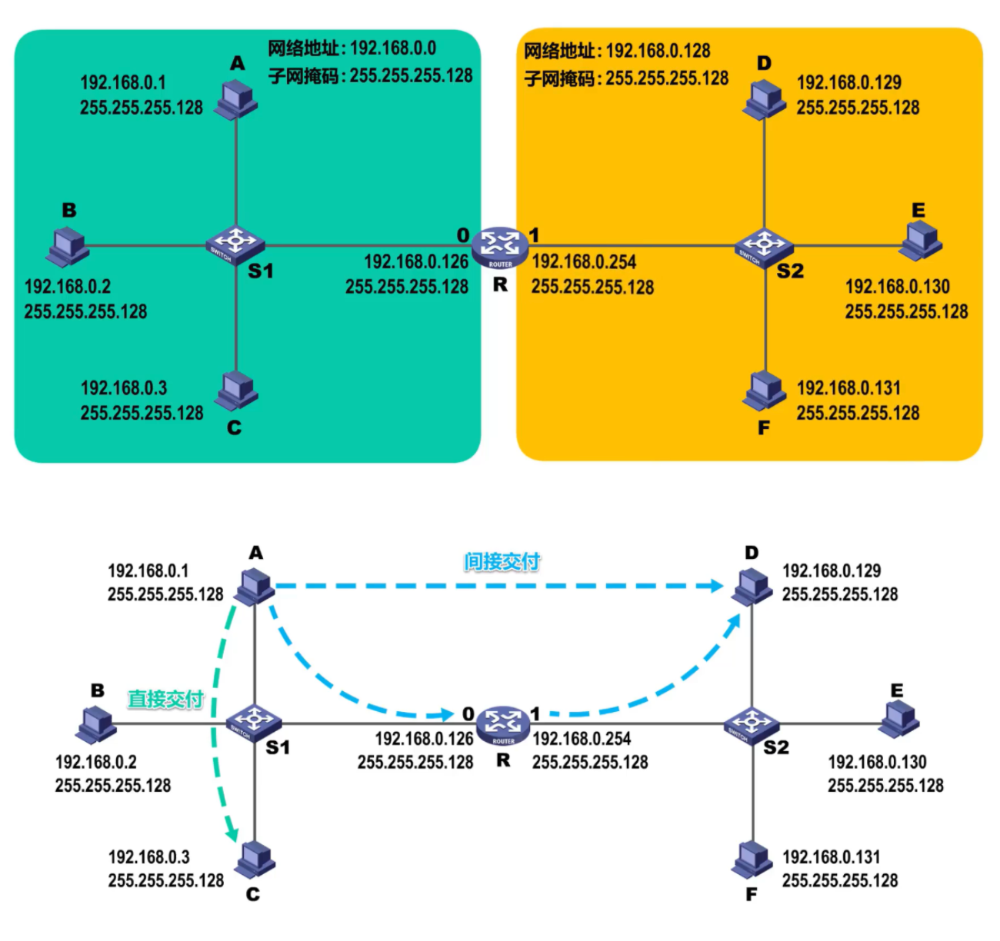
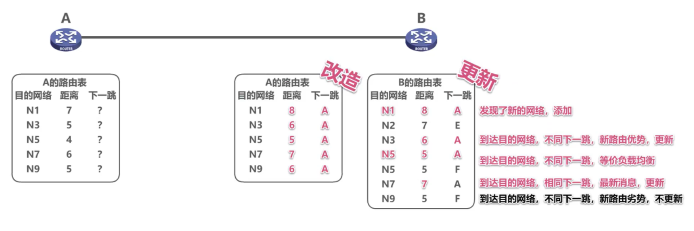
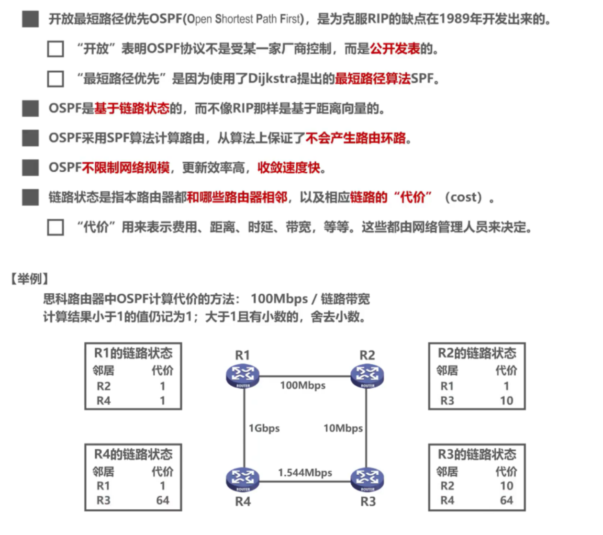

[TOC]

# chapter04_网络层

## 4.1 网络层概述

+ 网络层的主要任务是**实现网络互连**，进而**实现数据包在各网络之间的传输**

+ 要实现网络层任务，需要解决一下主要问题：

  + 网络层向运输层提供怎样的服务（"可靠传输"还是"不可靠传输"）

  在数据链路层那课讲过的可靠传输，详情回看：网络层对以下的**分组丢失**、**分组失序**、**分组重复**的传输错误采取措施，使得接收方能正确接受发送方发送的数据，就是**可靠传输**，反之，如果什么措施也不采取，则是**不可靠传输**

  > 在不同网络体系结构中提供的服务可能是不同的，在因特网所使用的**TCP/IP协议**的网络层中使用的是**无连接、不可靠的数据报**服务。
  >
  > ATM、帧中继和X.25的网络层使用的都是面向连接的、可靠的虚电路服务。

  - 网络层寻址问题

  

  - 路由选择问题

> 路由器收到数据后，是依据什么来决定将数据包从自己的哪个接口转发出去？
>
> **依据数据包的目的地址和路由器中的路由表**
>
> 
>
> 但在实际当中，路由器是怎样知道这些路由记录？
>
> - 由用户或网络管理员进行**人工配置**，这种方法只适用于规模较小且网络拓扑不改变的小型互联网
> - **另一种是实现各种路由选择协议，由路由器执行路由选择协议中所规定的路由选择算法，而自动得出路由表中的路有记录，这种方法更适合规模较大且网络拓扑经常改变的大型互联网**

> > **网络层（网际层）除了 IP协议外，还有之前介绍过的地址解析协议ARP**，还有**网际控制报文协议ICMP**，**网际组管理协议IGMP**

**小结：**

## 4.2 网络层提供的两种服务

- 在计算机网络领域，网络层应该向运输层提供怎样的服务（“**面向连接**”还是“**无连接**”）曾引起了长期的争论。
- 争论焦点的实质就是：**在计算机通信中，可靠交付应当由谁来负责**？是**网络**还是**端系统**？

### 4.2.1 面向连接的虚电路服务

**一种观点：让网络负责可靠交付**

- 这种观点认为，应借助于电信网的成功经验，让网络负责可靠交付，计算机网络应模仿电信网络，使用**面向连接**的通信方式。
- 通信之前先建立**虚电路** (Virtual Circuit)，以保证双方通信所需的一切网络资源。
- 如果再使用可靠传输的网络协议，就可使所发送的分组无差错按序到达终点，不丢失、不重复。

**发送方** 发送给 **接收方** 的所有分组都沿着同一条虚电路传送

> - 虚电路表示这只是一条逻辑上的连接，分组都沿着这条逻辑连接按照存储转发方式传送，而并不是真正建立了一条物理连接。
> - 请注意，电路交换的电话通信是先建立了一条真正的连接。
> - 因此分组交换的虚连接和电路交换的连接只是类似，但并不完全一样

### 4.2.2 无连接的数据报服务

**另一种观点：网络提供数据报服务**

- 互联网的先驱者提出了一种崭新的网络设计思路。
- 网络层向上只提供简单灵活的、**无连接的**、**尽最大努力交付**的**数据报服务**。
- 网络在发送分组时不需要先建立连接。每一个分组（即 IP 数据报）独立发送，与其前后的分组无关（不进行编号）。
- **网络层不提供服务质量的承诺**。即所传送的分组可能出错、丢失、重复和失序（不按序到达终点），当然也不保证分组传送的时限。

**发送方** 发送给 **接收方** 的分组可能沿着不同路径传送

> **尽最大努力交付**
>
> - 如果主机（即端系统）中的进程之间的通信需要是可靠的，那么就由网络的**主机中的运输层负责可靠交付（包括差错处理、流量控制等）** 。
> - **采用这种设计思路的好处是**：网络的造价大大降低，运行方式灵活，能够适应多种应用。
> - 互连网能够发展到今日的规模，充分证明了当初采用这种设计思路的正确性。

**数据报服务和虚电路服务对比：**

## 4.3 IPv4地址

### 4.3.1 IPv4地址概述

### 4.3.2 分类编址的IPv4地址

最高几位固定为0、10、110、1110、1111

每一类地址都由两个固定长度的字段组成，其中一个字段是**网络号 net-id**，它标志主机（或路由器）所连接到的网络，而另一个字段则是**主机号 host-id**，它标志该主机（或路由器）。

主机号在它前面的网络号所指明的网络范围内必须是唯一的。

由此可见，**一个 IP 地址在整个互联网范围内是唯一的**。

**A类地址：**

**B类地址：**

**C类地址：**

> 

> [**考研2017年 题36**] 下列IP地址中，只能作为IP分组的源IP地址但不能作为目的IP地址的是
>
> A. 0.0.0.0     B. 127.0.0.1     C.20.10.10.3      D.255.255.255.255
>
> 【**答案**】A
>
> 【**解析**】
>
> **地址0.0.0.0**是一个特殊的IP地址，只能作为源地址使用，**表示“在本网络上的本主机”**。封装有DHCP Discovery报文的IP分组的源地址使用0.0.0.0。
>
> **以127开头**且后面三个字节非“全0”或“全1”的IP地址是一类特殊的IP地址，**既可以作为源地址使用，也可以作为目的地址使用**，用于本地软件环回测试，例如常用的环回测试地址127.0.0.1。
>
> **地址255.255.255.255是一个特殊的IP地址**，只能作为**目的地址**使用，表示“只在本网络上进行广播（各路由器均不转发）”。 综上所述，选项A正确。
>
>  

> 

**IP 地址的一些重要特点**

(1) **IP 地址是一种分等级的地址结构**。分两个等级的好处是：

- **第一**，IP 地址管理机构在分配 IP 地址时只分配网络号，而剩下的主机号则由得到该网络号的单位自行分配。这样就方便了 IP 地址的管理。
- **第二**，路由器仅根据目的主机所连接的网络号来转发分组（而不考虑目的主机号），这样就可以使路由表中的项目数大幅度减少，从而减小了路由表所占的存储空间。

(2) **实际上 IP 地址是标志一个主机（或路由器）和一条链路的接口**。

- 当一个主机同时连接到两个网络上时，该主机就必须同时具有两个相应的 IP 地址，其网络号 net-id 必须是不同的。这种主机称为**多归属主机** (multihomed host)。
- 由于一个路由器至少应当连接到两个网络（这样它才能将 IP 数据报从一个网络转发到另一个网络），因此**一个路由器至少应当有两个不同的 IP 地址**。

(3) **用转发器或网桥连接起来的若干个局域网仍为一个网络**，因此这些局域网都具有同样的网络号 net-id。

(4) **所有分配到网络号 net-id 的网络，无论是范围很小的局域网，还是可能覆盖很大地理范围的广域网，都是平等的。**

### 4.3.3 划分子网的IPv4地址

**为什么要划分子网：**

在 ARPANET 的早期，IP 地址的设计确实不够合理：

- IP 地址空间的利用率有时很低。
- 给每一个物理网络分配一个网络号会使路由表变得太大因而使网络性能变坏。
- 两级的 IP 地址不够灵活。

如果想要将原来的网络划分为三个独立的网路

所以是否可以从主机号部分借用一部分作为子网号？

> 但是如果未在图中标记子网号部分，那么我们和计算机又如何知道分类地址中主机号有多少比特被用作子网号了呢？
>
> 所以就有了划分子网的工具：**子网掩码**
>
> - 从 1985 年起在 IP 地址中又增加了一个“**子网号字段**”，使两级的 IP 地址变成为**三级的 IP 地址**。
> - 这种做法叫做**划分子网** (subnetting) 。
> - 划分子网已成为互联网的正式标准协议。

**如何划分子网？**

- 划分子网纯属一个**单位内部的事情**。单位对外仍然表现为没有划分子网的网络。
- 从主机号**借用**若干个位作为**子网号** subnet-id，而主机号 host-id 也就相应减少了若干个位。

- 凡是从其他网络发送给本单位某个主机的 IP 数据报，仍然是根据 IP 数据报的**目的网络号** net-id，先找到连接在本单位网络上的路由器。
- 然后**此路由器**在收到 IP 数据报后，再按**目的网络号** net-id 和**子网号** subnet-id 找到目的子网。
- 最后就将 IP 数据报直接交付目的主机。

**划分为三个子网后对外仍是一个网络**

> - **优点**
>   1. 减少了 IP 地址的浪费
>   2. 使网络的组织更加灵活
>   3. 更便于维护和管理
> - **划分子网纯属一个单位内部的事情，对外部网络透明**，对外仍然表现为没有划分子网的一个网络。

**子网掩码**：

**默认子网掩码**：

> **子网掩码**是一个网络或一个子网的重要属性。
>
> 路由器在和相邻路由器交换路由信息时，必须把自己所在网络（或子网）的子网掩码告诉相邻路由器。
>
> **路由器的路由表中的每一个项目，除了要给出目的网络地址外，还必须同时给出该网络的子网掩码**。
>
> 若一个路由器连接在两个子网上，就拥有两个网络地址和两个子网掩码。

**小结：**

### 4.3.4 无分类编址的IPv4地址

**为什么使用无分类编址?**

**无分类域间路由选择 CIDR** (Classless Inter-Domain Routing)。

**CIDR 最主要的特点**

- CIDR使用各种长度的“**网络前缀**”(network-prefix)来代替分类地址中的网络号和子网号。
- **IP 地址从三级编址（使用子网掩码）又回到了两级编址**。

**如何使用无分类编址？**

**路由聚合(构成超网)**

**小结：**

### 4.3.5 IPv4地址的应用规划

IPv4地址的应用规划考虑得是给定一个IPv4地址块，如何将其划分成几个更小的地址块(来满足多子网划分)，并将这些地址块分配给互联网中不同网络，进而可以给各网络中的主机和路由器接口分配IPv4地址。
IPv4的应用规划有两种，也就是我们上面讲诉的两种：**定长的子网掩码划分FLSM、变长的子网掩码划分VLSM**。

**定长的子网掩码划分：**

+ 使用同一个子网掩码来划分子网
+ 子网划分方式不灵活，只能划分出2^n个子网掩码（n是从主机号部分借用来作为网络号的比特数量）
+ 每个子网所分配IP地址数量相同（主机号相同），对于不同地址数量的子网，容易造成IP地址浪费

**变长的子网掩码：**

- 使用**不同的子网掩码来划分子网**（不分类地址）
- 子网**划分方式灵活**，可以按需分配
- **每个子网所分配的IP地址可以不同，尽可能减少对IP地址的浪费**

### 4.3.6 IPv4数据报的首部格式

## 4.4 IP数据报的发送与转发过程

源主机如何知道目的主机是否与自己在同一个网络中，是直接交付，还是间接交付？

可以通过**目的地址IP**和**源地址的子网掩码**进行**逻辑与运算**得到**目的网络地址**

- 如果**目的网络地址**和**源网络地址** **相同**，就是**在同一个网络**中，属于**直接交付**
- 如果**目的网络地址**和**源网络地址** **不相同**，就**不在同一个网络**中，属于**间接交付**，传输给主机所在网络的**默认网关**（路由器——下图会讲解）,由默认网关帮忙转发。

主机C如何知道路由器R的存在？

用户为了让本网络中的主机能和其他网络中的主机进行通信，就必须给其指定本网络的一个路由器的接口，由该路由器帮忙进行转发，所指定的路由器，也被称为**默认网关**

例如。路由器的接口0的IP地址192.168.0.128做为左边网络的默认网关

> 主机A会将该IP数据报传输给自己的默认网关，也就是图中所示的路由器接口0

路由器收到IP数据报后如何转发？

- 检查IP数据报首部是否出错：
  - 若出错，则直接丢弃该IP数据报并通告源主机
  - 若没有出错，则进行转发
- 根据IP数据报的目的地址在路由表中查找匹配的条目：
  - 若找到匹配的条目，则转发给条目中指示的吓一跳
  - 若找不到，则丢弃该数据报并通告源主机

假设IP数据报首部没有出错，路由器取出IP数据报首部各地址字段的值

接下来路由器对该IP数据报进行查表转发

> 逐条检查路由条目，将目的地址与路由条目中的地址掩码进行逻辑与运算得到目的网络地址，然后与路由条目中的目的网络进行比较，如果相同，则这条路由条目就是匹配的路由条目，按照它的下一条指示，图中所示的也就是接口1转发该IP数据报

路由器是隔离广播域的

## 4.5 静态路由配置及其可能产生的路由环路问题

**静态路由配置：**

**默认路由：**

默认路由可以被所有网络匹配，但路由匹配有优先级，默认路由是优先级最低的

**特定主机路由**

有时候，我们可以给路由器添加针对某个主机的特定主机路由条目，一般用于网络管理人员对网络的管理和测试

**静态路由配置错误导致路由环路**

假设将R2的路由表中第三条目录配置错了下一跳

这导致R2和R3之间产生了路由环路

**聚合了不存在的网络而导致路由环路**

> 黑洞路由的下一跳为null0，这是路由器内部的虚拟接口，IP数据报进入它后就被丢弃

**网络故障而导致路由环路**

添加故障的网络为黑洞路由

假设一段时间后故障网络恢复了，R1又自动地得出了其接口0的直连网络的路由条目，针对该网络的黑洞网络会自动失效

**小结：**

## 4.6 路由选择协议

### 4.6.1 路由选择协议概述

**因特网所采用的路由选择协议的主要特点**

**因特网采用分层次的路由选择协议**

- **自治系统 AS**：在单一的技术管理下的一组路由器，而这些路由器使用一种 AS 内部的路由选择协议和共同的度量以确定分组在该 AS 内的路由，同时还使用一种 AS 之间的路由选择协议用以确定分组在 AS之间的路由。

> 自治系统之间的路由选择简称为域间路由选择，自治系统内部的路由选择简称为域内路由选择

  

> 域间路由选择使用外部网关协议EGP这个类别的路由选择协议
>
> 域内路由选择使用内部网关协议IGP这个类别的路由选择协议
>
> **网关协议**的名称可称为**路由协议**

**常见的路由选择协议**

**路由器的基本结构**

### 4.6.2 路由信息协议RIP的基本工作原理

**RIP的基本工作过程**

**RIP的路由条目的更新规则**

> 路由器C的表到达各目的网络的下一条都记为问号，可以理解为路由器D并不需要关心路由器C的这些内容
>
> 假设路由器C的RIP更新报文发送周期到了，则路由器C将自己路由表中的相关路由信息封装到RIP更新报文中发送给路由器D

>  路由器C能到达这些网络，说明路由器C的相邻路由器也能到达，只是比路由器C的距离大1，于是根据距离的对比，路由器D更新自己的路由表

**RIP存在“坏消息传播得慢”的问题**

解决方法

> 但是，这些方法也不能完全解决“坏消息传播得慢”的问题，这是距离向量的本质决定

**小结：**

> RIP 协议的优缺点
>
> 优点：
>
> 1. 实现简单，开销较小。
>
> 缺点：
>
> 1. RIP 限制了网络的规模，它能使用的最大距离为 15（16 表示不可达）。
> 2. 路由器之间交换的路由信息是路由器中的完整路由表，因而随着网络规模的扩大，开销也就增加。
> 3. “坏消息传播得慢”，使更新过程的收敛时间过长。

### 4.6.3 开放最短路径优先OSPF协议

**开放最短路径优先 OSPF (Open Shortest Path First)**

**注意**：OSPF 只是一个协议的名字，它并不表示其他的路由选择协议不是“最短路径优先”。

**概念**

**问候（Hello）分组**

### 4.6.4 边界网关协议BGP

## 4.7 网际控制报文协议ICMP

## 4.8 虚拟专用网VPN和网络地址转换NAT

### 4.8.1 虚拟专用网VPN

### 4.8.2 网络地址转换NAT 

https://juejin.cn/post/6887459316241498119

