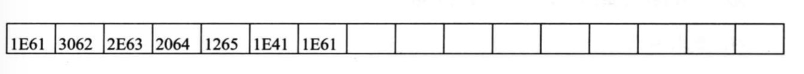

# 第17章 使用BIOS进行键盘输入和磁盘读写

## 17.1 int 9中断例程对键盘输入的处理

一般的键盘输入，在CPU执行完int 9中断例程后，都放到了键盘缓冲区中。键盘缓冲区共有16个字单元。可存储15个按键的扫描码和对应的ASCII码

例如：通过下面几个按键

A、B、C、D、E、Shift_A、A

缓冲区内容如下：



## 17.2 使用int 16h中断例程读取键盘缓冲区

```asm
mov ah, 0
int 16h
```

结果：(ah) = 扫描码 (al) = ASCII码

编程，接收用户的键盘输入，输入“r”，将屏幕上的字符设置为红色，“g”绿色，“b”蓝色

```asm
assume cs:code

code segment
	start:	mov ah,0
			int 16h
			
			mov ah,1	; 1表示蓝色
			cmp al,'r'
			je red
			cmp al,'g'
			je green
			cmp al,'b'
			je blue
			jmp short sret
			
	  red:	shl ah,1	; 4表示红色
    green:	shl ah,1	; 2表示绿色
     blue:	mov bx,0b800h
     		mov es,bx
     		mov bx,1
     		
     		mov cx,2000
     	s:	and byte ptr es:[bx],11111000b
     		or es:[bx],ah
     		add bx,2
     		loop s
     		
     sret:	mov ax,4c00h
     		int 21h
     		
code ends
end start
```

## 17.3 字符串的输入

> 编写一个接收字符串输入的子程序，实现3个基本功能：输入的同时显示这个字符串，在输入回车后输入结束，删除已经输入的字符
>
> 参数：(dh)、(dl)=字符串在屏幕上显示的行、列位置，ds:si指向字符串的存储空间
>
> 因为删除是从尾开始删，即后进先出，所以字符串的存储空间实际是一个字符栈
>
> 输入回车后，在字符串中加0，表示结束
>
> 每次有输入或删除时，都应该从栈底到栈顶的字符都显示一遍
>
> 这些功能可以编写为子程序
>
> (ah)=功能号 0表示入栈，1表示出栈，2表示显示，(al)=入栈/出栈的字符

```asm
getstr:		push ax

getstrs:	mov ah,0
			int 16h
			cmp al,20h
			jb nochar		; ASCII码小于20h说明不是字符
			mov ah,0
			call charstack	; 字符入栈
			mov ah,2
			call charstack	; 显示栈中的字符
			jmp getstrs
			
 nochar:	cmp ah,0eh		; 退格键的扫描码
 			je backspace
 			cmp ah,1ch		; Enter键的扫描码
 			je enter
 			jmp getstrs
 			
 backspace:	mov ah,1
 			call charstack	; 字符出栈
 			mov ah,2
 			call charstack	; 显示栈中的字符
 			jmp getstrs
 			
 	enter:	mov al,0
 			mov ah,0		; 把0入栈
 			call charstack
 			mov ah,2
 			call charstack	; 显示栈中的字符
 			pop ax
 			ret
 			
 			
charstack:	jmp short charstart

	table	dw charpush,charpop,charshow
	top		dw 0			; 栈顶
	
charstart:	push bx
			push dx
			push di
			push es
			
			cmp ah,2
			ja sret			; 如果ah>2 无效功能号，返回
			mov bl,ah
			mov bh,0
			add bx,bx		
			jmp word ptr table[bx]	;通过表跳转到相应的子程序	
			
charpush:	mov bx,top
			mov [si][bx],al
			inc top
			jmp sret
			
charpop:	cmp top,0		; 判断当前栈是否为空
			je sret
			dec top
			mov bx,top
			mov al,[si][bx]
			jmp sret
			
 charshow:	mov bx,0b800h
 			mov es,bx
 			mov al,160
 			mov ah,0
 			mul dh			; (dh)、(dl)分别表示显示的行、列
 			mov di,ax
 			add dl,dl
 			mov dh,0
 			add di,dx		; di表示要显示的偏移地址
 			
 			mov bx,0		; 从栈底开始显示
 			
charshows:	cmp bx,top		; 判断字符串是否已经全部显示
			jne noempty
			mov byte ptr es:[di],' '
			jmp sret
noempty:	mov al,[si][bx]
			mov es:[di],al
			mov byte ptr es:[di+2],' '
			inc bx
			add di,2
			jmp charshows
			
	sret:	pop es
			pop di
			pop dx
			pop bx
			ret
```

## 17.4 应用int 13h中断例程对磁盘进行读写

```asm
; 读取0面0道1扇区的内容到0:200
; es:bx指向接收从扇区读入数据的内存区
mov ax,0
mov es,ax
mov bx,200h

; (ah)=int 13h的功能号(2 表示读扇区 3表示写扇区)
; (al)=写入的扇区数
; (ch)=磁道号
; (cl)=扇区号
; (dh)=磁头号(面号)
; (dl)=驱动器号 
; 软驱从0开始	0：软驱A 1：软驱B
; 硬盘从80h开始	80h：硬盘C 81h：硬盘D
mov al,1
mov ch,0
mov cl,1
mod dl,0
mov dh,0
mov ah,2
int 13h
; 返回参数：
; 操作成功：(ah)=0 (al)=写入的扇区数
; 操作失败：(ah)=出错的代码
```

```asm
; 将0：200 中的内容写入0面0道1扇区
mov ax,0
mov es,ax
mov bx,200h
; (ah)=int 13h的功能号(3表示写扇区)
; (al)=写入的扇区数
; (ch)=磁道号
; (cl)=扇区号
; (dh)=磁头号(面号)
; (dl)=驱动器号 
; 软驱从0开始	0：软驱A 1：软驱B
; 硬盘从80h开始	80h：硬盘C 81h：硬盘D
mov al,1
mov ch,0
mov cl,1
mod dl,0
mov dh,0
mov ah,3
int 13h
```


编程：将当前屏幕的内容保存到磁盘中

```asm
assume cs:code
code segment
	start:	mov ax,0b800h
			mov es,ax
			mov bx,0
			
			mov al,8	; 一屏4000字节，需要8个扇区
			mov ch,0
			mov cl,1
			mov dl,0
			mov dh,0
			mov ah,3
			int 13h
			
			mov ax, 4c00h
			int 21h
code ends
end start
```

实验：安装一个新的int 7ch中断例程，实现通过逻辑扇区号对软盘进行读写

```asm
assume cs:code

code segment
	start:	mov ax,cs
			mov ds,ax
			mov si,offset int7cstart
			
			mov ax,0
			mov es,ax
			mov di,200h
			
			mov cx,offset int7cend-offset int7cstart
			cld
			rep movsb
			
			cli
			mov ax,0
			mov ds,ax
			mov word ptr ds:[4*7ch],200h
			mov word ptr ds:[4*7ch+2],0
			sti
			
			mov ax,4c00h
			int 21h
            
int7cstart:	cmp ah,1	
			ja ok		; 违法的功能号
			
			push ax		; 保护现场
			push bx
			push cx
			push dx
			
			push ax		; ah中存着功能号
			
			mov ax,dx	; 传递逻辑扇区号
			mov dx,0
			mov cx,1440
			div cx
			push ax		; ax保存得到的商，即面号，入栈保存
			
			mov cx,18
			mov ax,dx	; 所得结果的余数传递给ax，继续做除法
			mov dx,0
			div cx
			push ax		; ax保存得到的商，即磁道号
			inc dx		; 计算出扇区号
			push dx		; 入栈保存
			
			pop ax
			mov cl,al	; 扇区号
			pop ax
			mov ch,al	; 磁道号
			pop ax
			mob dh,al	; 面号
			mov dl,0	; 驱动器号
			pop ax		; 弹出ax，其中ah中存着功能号
			mov al,1	; 扇区数
			
			cmp ah,0
			je read
			cmp ah,1
			je write
			
	read:	mov ah,2
			jmp short func
	write:	mov ah,3
			jmp short func
	func:	int 13h
			
			pop dx		; 恢复现场
			pop cx
			pop bx
			pop ax
			
      ok:	iret
      
  int7cend:	nop
  
  code ends
  end start

```

