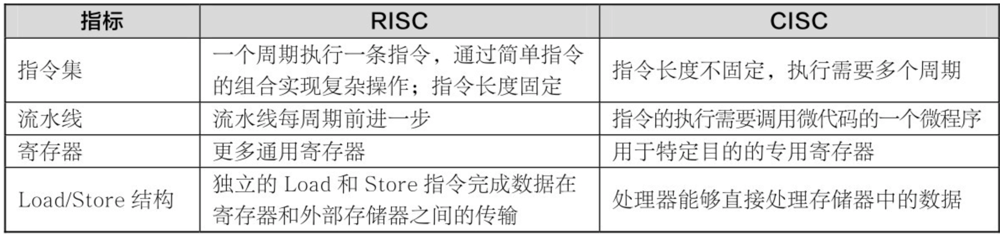
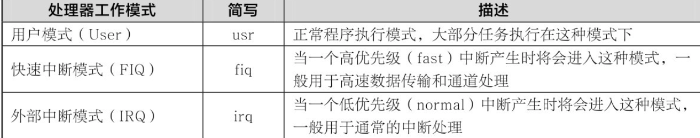
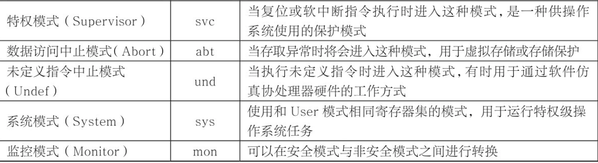
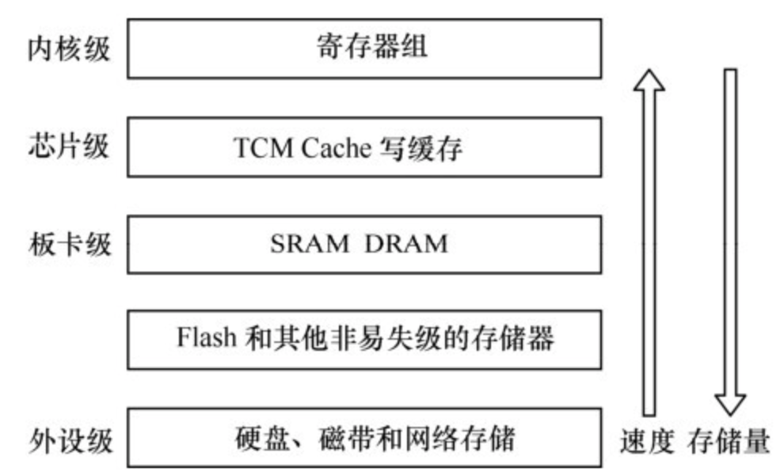
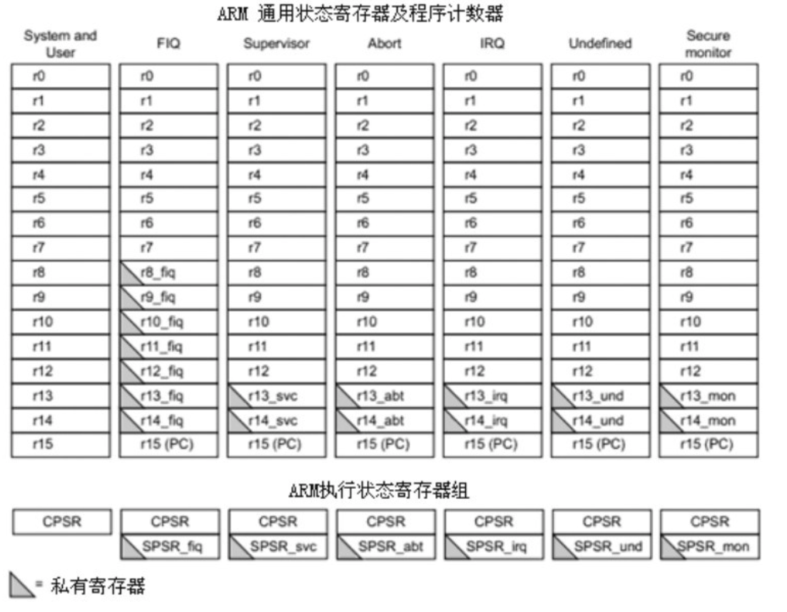
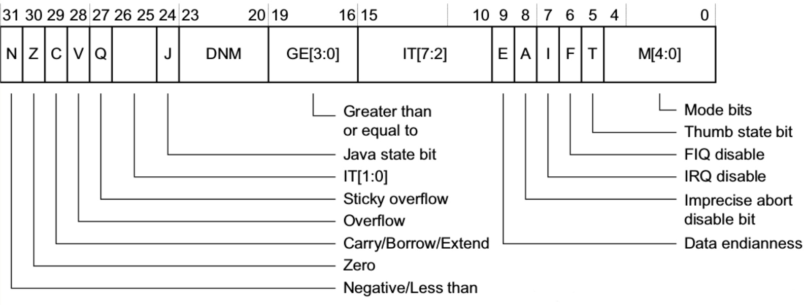
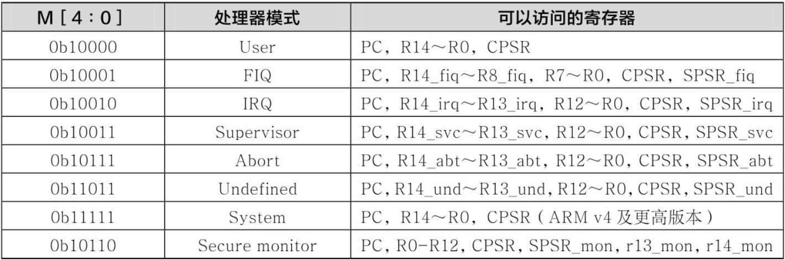
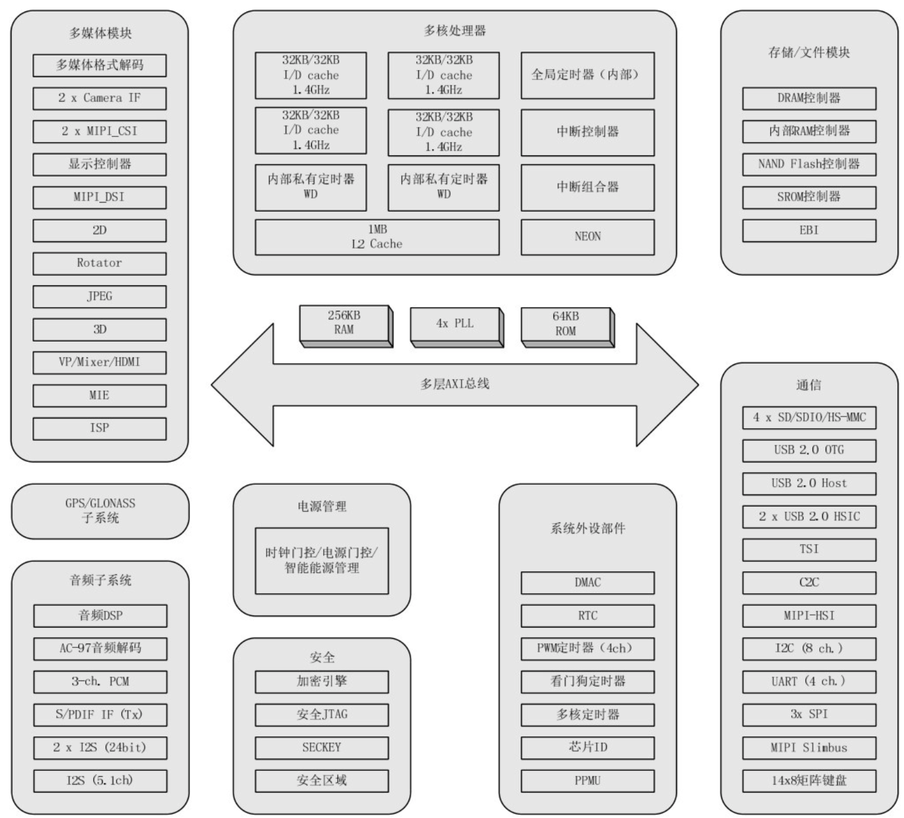

[TOC]

# chapter01_ARM汇编基础

## 1.1 嵌入式ARM技术概述

ARM(Advanced RISC Machines)

+ 一个公司的名称
+ 一类微处理器的通称
+ 一种技术的名称

### 1.1.1 ARM体系结构的技术特征与发展

公司本身并不直接从事芯片生产，而是靠转让设计许可由合作公司生产各具特色的芯片，世界各大半导体生产商从ARM公司购买其设计的ARM微处理器核，根据各自不同的应用领域，加入适当的外围电路，从而形成自己的ARM微处理器芯片进入市场

ARM处理器有如下特点：

+ 体积小、低功耗、低成本、高性能。
+ 支持Thumb（16位）/ARM（32位）双指令集，能很好地兼容8位/16位器件。
+ 大量使用寄存器，指令执行速度更快。
+ 大多数数据操作都在寄存器中完成。
+ 寻址方式灵活简单，执行效率高。
+ 指令长度固定



### 1.1.2 ARM微处理器简介

### 1.1.3 ARM微处理器架构

### 1.1.4 ARM微处理器的应用选型

+ 功能
+ 性能
+ 价格
+ 熟悉程度及开发资源
+ 操作系统支持
+ 升级
+ 供货稳定

### 1.1.5 Cortex-A9 内部功能及特点

### 1.1.6 数据类型

Cortex-A9 采用的是 32 位架构，ARM 的基本数据类型有以下3种：

+ Byte：字节，8bit
+ Halfword：半字，16bit（半字必须与 2 字节边界对齐）
+ Word：字，32bit（字必须与 4 字节边界对齐）

**Note:**

1. ARM 系统结构 v4 以上版本支持以上 3 种数据类型，v4 以前版本仅支持字节和字。
2. 当将这些数据类型中的任意一种声明成 unsigned 类型时，n 位数据值表示范围为 0～2^n −1的非负数，通常使用二进制格式。
3. 当将这些数据类型的任意一种声明成 signed 类型时，n 位数据值表示范围为−2^(n−1) ～2^(n−1) −1的整数，使用二进制的补码格式。
4. 所有数据类型指令的操作数都是字类型的，如“ADD r1，r0，＃0x1”中的操作数“0x1”就是以字类型数据处理的。
5. Load/Store 数据传输指令可以从存储器存取传输数据，这些数据可以是字节、半字、字。加载时自动进行字节或半字的零扩展或符号扩展。对应的指令分别为 LDR/BSTRB（字节操作）、LDRH/STRH（半字操作）、LDR/STR（字操作）。详见后面的指令参考。
6. ARM 指令编译后是 4 字节（与字边界对齐）。Thumb 指令编译后是 2 字节（与半字边界对齐）。

**浮点数类型：**

浮点运算使用在ARM硬件指令集中**未定义的数据类型**。尽管如此，ARM公司仍然在协处理器指令空间定义了一系列浮点指令。通常这些指令全部可以通过未定义指令异常（此异常收集所有硬件协处理器不接受的协处理器指令）在软件中实现，但是其中的一小部分也可以由浮点运算协处理器FPA10以硬件方式实现。另外，ARM公司还提供了用C语言编写的浮点库作为ARM浮点指令集的替代方法（Thumb代码只能使用浮点指令集）。该库支持IEEE标准的单精度和双精度格式。C编译器有一个关键字标志来选择这个历程。它产生的代码与软件仿真（通过避免中断、译码和浮点指令仿真）相比既快又紧凑。

**大端模式和小端模式：**

在大端模式下，一个字的高地址放的是数据的低位，而在小端模式下，数据的低位放在内存中的低地址

### 1.1.7 Cortex-A9 内核工作模式





除用户模式外的其他7种处理器模式称为特权模式（PrivilegedModes）。在特权模式下，程序可以访问所有的系统资源，也可以任意地进行处理器模式切换。其中以下6种又称为异常模式：

+ 快速中断模式(FIQ)
+ 外部中断模式(IRQ）
+ 特权模式(Supervior)
+ 数据访问中止模式(Abort)
+ 未定义指令中止模式(Undef)
+ 监控模式(Monitor)

处理器模式可以通过软件控制进行切换，也可以通过外部中断或异常处理过程进行切换

### 1.1.8 Cortex-A9 存储系统



### 1.1.9 流水线

三级流水线：取指-> 译码->执行

五级流水线：取指-> 译码 -> 执行 -> 缓冲 -> 写回

影响流水线的因素：

+ 互锁
+ 跳转指令

### 1.1.10 寄存器组织



ARM处理器有如下40个32位长的寄存器。

+ 33个通用寄存器
+ 6个状态寄存器：1个CPSR（CurrentProgram Status Register，当前程序状态寄存器），6个SPSR（Saved Program StatusRegister，备份程序状态寄存器）
+ 1个PC（Program Counter，程序计数器）

ARM处理器共有7种不同的处理器模式，在每一种处理器模式中都有一组相应的寄存器组

当前处理器的模式决定着哪组寄存器可操作，任何模式都可以存取下列寄存器：

+ 相应的R0～R12。
+ 相应的R13（Stack Pointer，SP，栈指向）和R14（the Link Register，LR，链路寄存器）
+ 相应的R15（PC）
+ 相应的CPSR 

特权模式（除System模式外）还可以存取相应的SPSR

通用寄存器根据其分组与否可分为以下两类：

+ 未分组寄存器（Unbanked Register），包括R0～R7
+ 分组寄存器（Banked Register），包括R8～R14

在ARM体系结构中，R8～R12没有任何指定的其他的用途，所以当FIQ中断到达时，不用保存这些通用寄存器，也就是说，FIQ 处理程序可以不必执行保存和恢复中断现场的指令，从而可以使中断处理过程非常迅速。所以FIQ模式常被用来处理一些时间紧急的任务，如DMA处理

R13寄存器在ARM处理器中常用做堆栈指针，称为SP

寄存器R14又被称为连接寄存器（Link Register，LR），它在ARM体系结构中具有下面两种特殊的作用。

每一种处理器模式用自己的R14存放当前子程序的返回地址。当通过BL或BLX指令调用子程序时，R14被设置成该子程序的返回地址。在子程序返回时，把R14的值复制到程序计数器（PC）。

典型的做法是使用下列两种方法之一:

① 执行下面任何一条指令。

```asm
MOV PC, LR
BX LR
```

② 在子程序入口处使用下面的指令将PC保存到堆栈中。

```asm
STMFD SP！，｛<register>，LR｝
```

在子程序返回时，使用如下相应的配套指令返回

```asm
LDMFD SP！，｛<register>，PC｝
```

当异常中断发生时，该异常模式特定的物理寄存器R14被设置成该异常模式的返回地址，对于有些模式R14的值可能与返回地址有一个常数的偏移量（如数据异常使用SUB PC，LR，#8返回）。具体的返回方式与上面的子程序返回方式基本相同，但使用的指令稍微有些不同，以保证当异常出现时正在执行的程序的状态被完整保存。

R14也可以被用做通用寄存器使用

### 1.1.11 程序状态寄存器

当前程序状态寄存器（Current Program StatusRegister，CPSR）可以在任何处理器模式下被访问，它包含下列内容。

+ ALU（Arithmetic Logic Unit，算术逻辑单元）状态标志的备份
+ 当前的处理器模式
+ 中断使能标志
+ 设置处理器的状态





### 1.1.12 三星Exynos4412处理器简介



## 1.2 ARM指令

### 1.2.1 ARM指令集

+ 数据处理指令
+ 跳转指令
+ 加载/存储指令
+ 杂项指令
+ 伪指令
+ 协处理器指令和异常处理指令

**数据处理指令**大致分为5类：

- 算术运算指令：ADD,ADC,SUB,SBC,RSB,RSC,MUL,MLA,UMULL,UMAL,SMULL,SMLAL
- 逻辑运算指令：AND,ORR,EOR,BIC
- 数据传送指令：MOV,MVN(将operand2位取反传送到目标寄存器Rd中,立即数非法，但取反合法)
- 比较指令CMP，CMN
- 测试指令：TST,TEQ

**跳转指令**：

ARM两种跳转方式：

- 一种使用跳转指令直接跳转
- 另一种直接向PC寄存器赋值实现跳转

ARM分支跳转指令，可以实现向前或向后跳转32M空间。按功能分为4类：

- B:分支指令

指令格式：`B{cond} label`

被限制在±32M的范围

```
;1.无条件跳转
	B  label
	....
label  ...

;2.执行10次循环
	MOV R0,#10
LOOP
	...
	SUBS RO,R0,#1
	BNE LOOP
```

- BL：带链接的分支指令

带链接跳转指令，指令将下一条指令的地址复制到R14(即LR)链接寄存器中，然后跳转到指定的地址运行.

```
	BL DELAY
	BL SUB1;LR<-下一条指令地址，跳转到子程序SUB1处
SUB1
	...
	MOV PC,LR   ;子程序返回
;注意：不应该再进行嵌套，避免覆盖R14导致无法返回
```

- BX：带状态切换的分支指令

带状态切换指令。跳转到Rm指令的地址执行程序：

```
*	若Rm的位`[0]`为1，则跳转时自动将CPSR中的标志T置位，将原代码解释位Thumb代码
*	若Rm的位`[0]`为0，则跳转时自动将CPSR中的标志T复位，原代码解释为ARM代码
```

- BLX：带连接和状态的分支指令

**存储器访问指令：**

对存储器访问只能使用加载和存储指令。SWP指将一条存储器和寄存器内容互换的指令，可用于信号量操作 除了RAM操作外，对外围IO、程序数据的访问均要通过`加载/存储`指令进行

基本`加载/存储`指令仅有5条，分为3类：

- LDR和STR，单寄存器`加载/存储`指令
- LDM和STM，多寄存器`加载/存储`指令
- SWP，寄存器和存储数据交互指令

```
LDR R2,[R5]    ;加载R5指定地址上的数据(字)，放入R2中
STR R1,[R0,#0x04]  ;将R1的数据存储到R0+0x04存储单元，R0不变
;B 字节， SH，高16位，符号扩展   H，高16位9扩展
```

**杂项指令**

主要由程序状态寄存器操作和中断操作两种类型组成，一共5条指令：

- 1. 状态寄存器操作指令

  - MRS:读程序状态寄存器指令
  - MSR:写程序状态寄存器指令

- 2.异常中断操作指令

  - SWI:软中断
  - BKPT：断点指令(v5T系统)

SWI：

软中断指令SWI产生软件异常中断，用来实现用户模式到特权模式的切换。它将处理器置于管理(svc)模式，中断矢量地址位0x08：指令格式位`SWI {cond} <24位立即数>`

主要用于用户程序调用操作系统的API，参数传递通常有两种方式:

- 1.指令中的24位立即数指定API号，其他通过寄存器传递
- 2.忽略指令中24位立即数，R0指定API号，其他参数通过其他寄存器传递

```
;第1种，不传递参数
SWI 10       ;中断号为10   
SWI 0x123456 ;中断号为0x123456
;第1种，传递参数
MOV R0,#34
SWI 12

;第2种，不用指令种立即数，软中断号和其他参数都在寄存器中传递

MOV R0,#12   ;准备中断号
MOV R1,#34   ;准备参数
SWI 0        ;进入软中断
```

### 1.2.2 ARM指令的寻址方式

1. 寄存器寻址

```
SUB R0,R1,R2   ;R1-R2->R0
```

2. 立即数寻址

```
SUB R0,R0,#1
MOV R0,#0xff00
```

3. 寄存器偏移寻址

```
MOV R0,R2,LSL #3      ;R2的值左移3位，结果翻入R0，即R0 = R2x8
ANDS R1,R1,R2,LSL R3  ;R2值左移R3位，然后和R1相与操作，结果放入R1中
```

第2个操作数移位方式，6种：

LSL逻辑左移 LSR逻辑右移 ASL算术左移 ASR算术右移 ROR循环右移 RRX带扩展的循环右移

4. 间接寻址

寄存器间接寻址，地址码给出一个通用寄存器编号，所需要的操作数保存在寄存器制定地址的存储单元中，即寄存器为操作数的地址指针

```
LDR  R0,[R1]   ;R0<- [R1]
STR  R0,[R1]   ;R0->[R1]
```

5. 基址寻址

基址寻址将基址寄存器的内容与指令中给出的偏移量相加，形成操作数的有效地址。

```
LDR R2,[R3,#0x0F] ;将R3中的数值加0x0F作为地址，取出此地址的数值保存在R2中
STR R1,[R0,#-2]   ;把R1保存到R0-2的地址的单元内容中
```

有3种偏址方式：

- 1. 前变址模式(不修改基址寄存器)

先基址+偏址，生成操作数地址，做指令指定的操作，也叫做前索引便宜

```
STR R0,[R1,#12]
```

- 2. 自动变址模式(修改基址寄存器) 先基址+偏址，生成操作数地址，做指令指定的操作，再自动修改基址寄存器;

```
LDR R0,[R1,#4]! ;R0<-mem32[R1+4],R1<-R1+4
```

- 3. 后变址模式(修改基址寄存器)

```
LDR R0,[R1],#4   ;R0<-[R1],R1=R1+4
```

6. 多寄存器寻址

多寄存器寻址就是一次可以传递几个寄存器值，允许一条指令传递16个寄存器的任何子集或所有寄存器:

```
LDMTA R1!,{R2-R7,R12},将R1的内容自动读到R2到R7，和R12，其中R1自动加1
```

7. 堆栈寻址

堆栈是一种数据结构，存储区的操作顺序为“先进先出”，堆栈指针SP。指针所指向的存储单元就是堆栈的栈顶。存储器堆栈可分为两种：

- 向上生长：向高地址方向生长，称为递增堆栈
- 向下生长：向低地址方向生长，成为递减堆栈

堆栈递增和递减的满堆栈和空堆栈的各种组合有4种：

满递增：堆栈通过增大存储器的地址方向上增长，堆栈指针指向内含有有效数据项的最高地址。如LDMFA和STMFA

空递增：堆栈通过增大存储器的地址向上增长，堆栈指针指向堆栈上的第一个空位置。指向LDMEA和STMEA等

满递减：堆栈通过减小存储器的地址向下增长，堆栈指针指向含有有效数据的最低地址。LDMFS和STMFD等

空递减：堆栈通过减小存储器的地址向下增长，堆栈指针指向堆栈下的第一个空位置。LDMED和STMED等。

```
STMFD sp!,{R4-R7,R1} ;满递减
LDMFA SP!,{R4-R7,pc} ;满递曾
```

8. 块复制寻址

块复制是多寄存器指令LDM/STM的寻址方式，

有4种寻址方式：

```
LDMIA/STMIA  ;Increment After(先传送，后地址加4)
LDMID/STMIB  ;Increment Before(先地址加4，后传送)
LDMDA/STMDA  ;Decrement After(先传送，后地址减4)
LDMDB/STMDB  ;Decrement Before(先地址减4，后传送)
STMIA R0!,{R1-R7} ;将R1-R7的数据保存到存储器中，存储器指针在保存第1个值之后增加
                  ;增长方向为向上增长
STMIB R0!,{R1-R7} ;将R1-R7的数据保存到存贮器中，存储器指针在保存第一个值之前增加
                  ;增长方向为向上增长
```

9. 相对寻址

相对寻址是基址的一种变通，由程序计数器PC提供基准地址，指令中的地址字段作为偏移，两者相加后得到地址即为操作数的有效地址。

```
	BL ROUTE1   ;调用到ROUTE1子程序
	BEQ LOOP    ;条件跳转到LOOP标号处
LOOP MOV R2,#2 ...
	ROUTE1
	...
```

学习：

寻址方式：

https://wenku.baidu.com/view/b638a34ddeccda38376baf1ffc4ffe473368fd18.html

https://ishare.iask.sina.com.cn/f/12XEJAMp9xuR.html

ARM伪指令：

https://github.com/BabyMelvin/Linux/blob/055d0a3a74c6324e730282dba57660283f63b329/arch/gnu_arm/0_GNU_ARM%E6%8C%87%E4%BB%A4.md


APCS、ATPCS规则：

https://github.com/JnuSimba/AndroidSecNotes/blob/4adab342c02f0db390f174e99731defe7dc3a15f/Android%E9%80%86%E5%90%91%E5%9F%BA%E7%A1%80/ARM%20%E6%B1%87%E7%BC%96%E4%BC%AA%E6%8C%87%E4%BB%A4%E7%AE%80%E4%BB%8B.md 

内联汇编：

https://juejin.cn/post/6955625430296559623